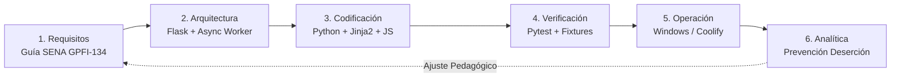
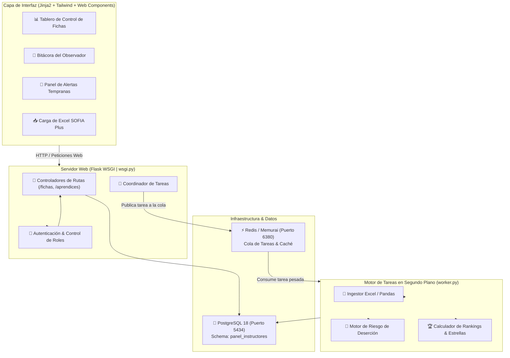
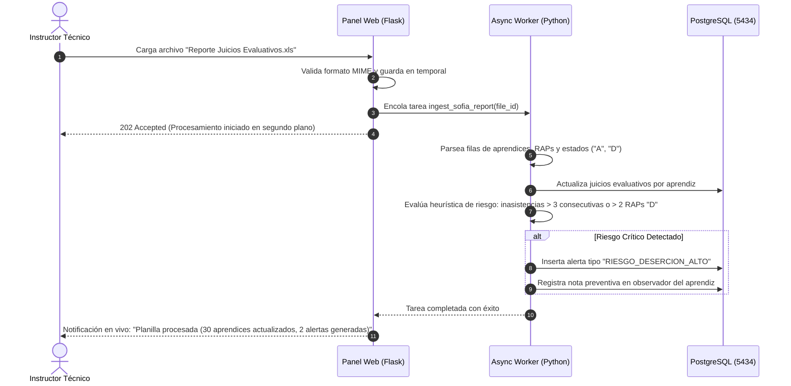
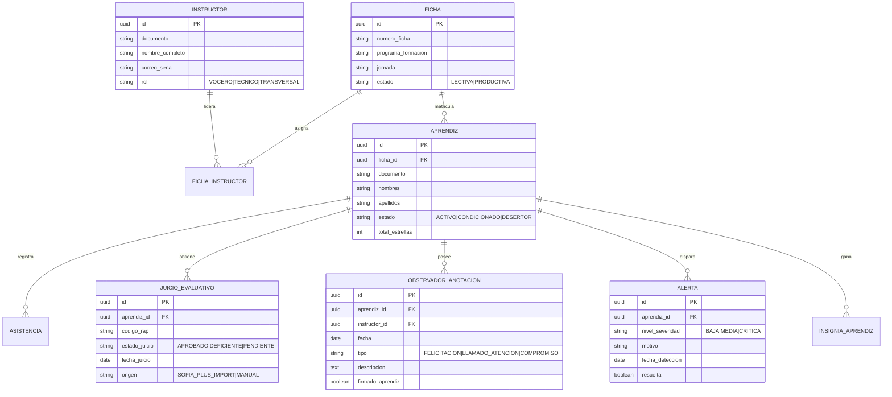

# 👨‍🏫 Panel de Instructores — Sistema Integral de Gestión Pedagógica y Analítica Académica SENA

[](https://python.org)
[](https://flask.palletsprojects.com/)
[-336791?style=for-the-badge&logo=postgresql&logoColor=white)](https://postgresql.org)
[](https://redis.io)
[](https://www.sena.edu.co)
[](docs/)
[](docs/)

> Plataforma tecnológica para instructores del **SENA**, orientada al seguimiento pedagógico integral, planeación curricular oficial (**GPFI-F-134**), sincronización de juicios evaluativos (**SOFIA Plus**), alerta temprana de deserción, observador digital y gamificación motivacional del aula.

---

## 📋 Tabla de Contenido
- [Visión del Sistema](#-visión-del-sistema)
- [Capacidades del Ecosistema](#-capacidades-del-ecosistema)
- [Ciclo de Desarrollo del Software (SDLC)](#-ciclo-de-desarrollo-del-software-sdlc)
  - [Fase 1: Contexto Pedagógico y Marco Normativo SENA](#fase-1-contexto-pedagógico-y-marco-normativo-sena)
  - [Fase 2: Arquitectura del Sistema y Procesamiento Asíncrono](#fase-2-arquitectura-del-sistema-y-procesamiento-asíncrono)
  - [Fase 3: Implementación y Tecnologías](#fase-3-implementación-y-tecnologías)
  - [Fase 4: Aseguramiento de Calidad y Pruebas](#fase-4-aseguramiento-de-calidad-y-pruebas)
  - [Fase 5: Despliegue y Orquestación](#fase-5-despliegue-y-orquestación)
  - [Fase 6: Monitoreo, Alertas y Mantenimiento](#fase-6-monitoreo-alertas-y-mantenimiento)
- [Diagramas del Proyecto](#-diagramas-del-proyecto)
  - [Diagrama de Arquitectura con Worker Asíncrono](#diagrama-de-arquitectura-con-worker-asíncrono)
  - [Diagrama de Secuencia: Ingesta de Reporte SOFIA Plus y Alerta de Deserción](#diagrama-de-secuencia-ingesta-de-reporte-sofia-plus-y-alerta-de-deserción)
  - [Diagrama Entidad-Relación Pedagógico (ERD)](#diagrama-entidad-relación-pedagógico-erd)
- [Estructura del Repositorio](#-estructura-del-repositorio)
- [Guía de Arranque Rápido](#-guía-de-arranque-rápido)
- [Testing y Verificación](#-testing-y-verificación)
- [Licencia Institucional](#-licencia-institucional)

---

## 🎯 Visión del Sistema

La labor del instructor SENA combina la docencia técnica con una alta carga operativa documental: diligenciamiento de la planeación pedagógica (**Formato GPFI-F-134**), registro de novedades en el observador, control de asistencia, seguimiento a compromisos de comités de evaluación y sincronización de juicios evaluativos en **SOFIA Plus**.

El **Panel de Instructores** centraliza y automatiza estas actividades en una suite interactiva:
1. **Ingesta Automática de Juicios**: Procesamiento inteligente de hojas de cálculo exportadas de SOFIA Plus sin necesidad de digitación manual.
2. **Sistema de Alerta Temprana de Deserción**: Algoritmo heurístico que detecta patrones de inasistencia continua, atraso en evidencias críticas y bajo rendimiento antes de que el aprendiz abandone la formación.
3. **Observador Digital del Aprendiz**: Registro inmutable de anotaciones positivas, llamados de atención y actas de compromiso con trazabilidad por corte.
4. **Gamificación y Cultura de Ambiente**: Sistema de insignias al mérito, estrellas de entrega a tiempo y organización de responsabilidades (aseo y cuidado de equipos).

---

## 🌟 Capacidades del Ecosistema

- 📑 **Planeación Pedagógica GPFI-F-134**: Mapeo directo de actividades de aprendizaje, técnicas didácticas activas, ambientes y criterios de evaluación.
- ⚡ **Ingesta Inteligente de Reportes Excel**: Procesador masivo de archivos `.xls`/`.xlsx` de juicios evaluativos de SOFIA Plus con detección de inconsistencias.
- 🚨 **Módulo de Alertas Preventivas**: Semáforo por aprendiz (*Riesgo Bajo*, *Riesgo Medio*, *Riesgo Crítico de Deserción*).
- 🏆 **Gamificación del Aprendizaje**: Ranking del grupo, cuadro de honor e insignias coleccionables para incentivar la excelencia técnica y el trabajo colaborativo.
- 🧹 **Organización y Disciplina de Taller**: Gestión de roles de ambiente (responsables de inventario, orden y aseo por semana).

---

## 🔄 Ciclo de Desarrollo del Software (SDLC)



### Fase 1: Contexto Pedagógico y Marco Normativo SENA
- **Reglamento del Aprendiz (Acuerdo 007 de 2012)**: Tipificación de faltas académicas y disciplinarias, causales de deserción y debido proceso.
- **Formato Oficial GPFI-F-134**: Modelado relacional de la estructura pedagógica de proyectos formativos.
- **Requisitos No Funcionales (NFR)**:
  - Procesamiento en background de archivos Excel de más de 1,000 registros en menos de 5 segundos.
  - Cero fallos silenciosos en el worker de sincronización (`stdout logging` prioritario).

### Fase 2: Arquitectura del Sistema y Procesamiento Asíncrono
- **Arquitectura Híbrida**: Web Server Flask sincrónico + `worker.py` dedicado a tareas pesadas de ingestión y cálculo de rankings.
- **Capa de Dominio y Servicios**: Separación de la lógica de alertas en servicios especializados (`alertas_service.py`, `evaluacion_service.py`).
- **Seguridad**: Prevención estricta de llaves secretas efímeras en producción y hashing de contraseñas con bcrypt.

### Fase 3: Implementación y Tecnologías
- **Backend Core**: Python 3.11, Flask 3.0, SQLAlchemy 2.0.
- **Procesamiento de Datos**: Pandas / OpenPyXL para lectura analítica de planillas institucionales.
- **Persistencia y Mensajería**: PostgreSQL 18 local (puerto `5434`), Memurai/Redis (puerto `6380`).

### Fase 4: Aseguramiento de Calidad y Pruebas
- Pruebas unitarias de cálculo de horas de inasistencia acumuladas.
- Pruebas de integración sobre simulación de reportes reales de juicios evaluativos (`Reporte de Juicios Evaluativos.xls`).

### Fase 5: Despliegue y Orquestación
- Compatibilidad dual: Scripts para Windows nativo (`start-windows.ps1`) y despliegue contenerizado (`Dockerfile` + `docker-entrypoint.sh`).

### Fase 6: Monitoreo, Alertas y Mantenimiento
- Envío automático de notificaciones a instructores voceros y comités de evaluación.

---

## 📊 Diagramas del Proyecto

### Diagrama de Arquitectura con Worker Asíncrono



### Diagrama de Secuencia: Ingesta de Reporte SOFIA Plus y Alerta de Deserción



### Diagrama Entidad-Relación Pedagógico (ERD)



---

## 📂 Estructura del Repositorio

```text
panel de instructores/
├── app/                      # Núcleo modular de la aplicación
│   ├── models/               # Entidades SQLAlchemy (Aprendiz, Juicio, Alerta, etc.)
│   ├── routes/               # Enrutadores y controladores de vistas
│   ├── services/             # Lógica de cálculo de deserción y rankings
│   ├── static/               # Hojas de estilo, logos institucionales y scripts
│   └── templates/            # Vistas Jinja2 (dashboard, observador, planeación)
├── docs/                     # Especificaciones pedagógicas y guías
├── config.py                 # Configuración canónica y lectura segura de entorno
├── worker.py                 # Worker asíncrono para ingesta pesada de Excel
├── wsgi.py                   # Punto de entrada WSGI para servidores web
├── seed_admin.py             # Script de inicialización de usuarios maestros
├── start-windows.ps1         # Script oficial de arranque local Windows nativo
├── requirements.txt          # Dependencias Python
└── README.md                 # Este documento
```

---

## 🚀 Guía de Arranque Rápido

### Prerrequisitos
- **Windows 10 / 11** nativo o Linux.
- **Python 3.11+**.
- **PostgreSQL 18** en puerto `5434` (schema `panel_instructores`).
- **Memurai / Redis** en puerto `6380`.

### 1. Clonar e Instalar Dependencias
```powershell
git clone https://github.com/miuguelt/panel-de-instructores.git
cd "panel de instructores"
python -m venv .venv
.\.venv\Scripts\Activate.ps1
pip install -r requirements.txt
```

### 2. Configurar Variables de Entorno
Copie `.env.example` a `.env` y ajuste sus parámetros locales:
```ini
FLASK_ENV=development
SECRET_KEY=clave_aleatoria_segura_desarrollo
DATABASE_URL=<TU_DSN_POSTGRESQL>
REDIS_URL=redis://127.0.0.1:6380/0
PORT=5000
```

### 3. Iniciar el Servidor Web y el Worker
```powershell
# En Windows nativo:
powershell -ExecutionPolicy Bypass -File .\start-windows.ps1

# O manualmente en dos consolas:
# Consola 1 (Web):
python wsgi.py
# Consola 2 (Worker Asíncrono):
python worker.py
```

Abra su navegador en: `http://127.0.0.1:5000`

---

## 🧪 Testing y Verificación

```powershell
# Ejecución de pruebas unitarias
pytest

# Validación de modelos pedagógicos
pytest tests/test_models.py
```

---

## 🏛️ Licencia Institucional

Desarrollado para el **Cuerpo de Instructores del SENA**.
Herramienta de innovación pedagógica bajo lineamientos institucionales.
